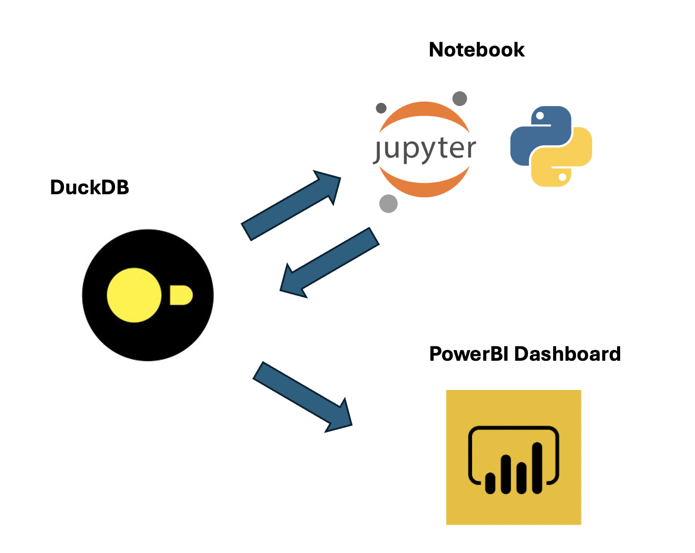
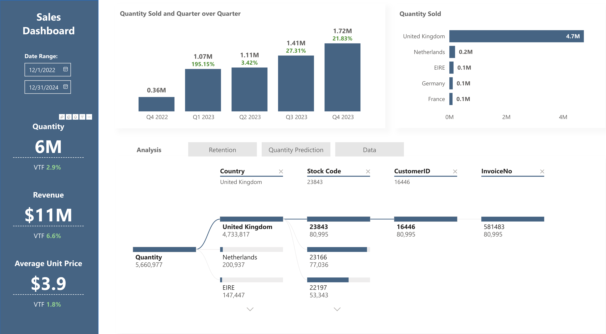
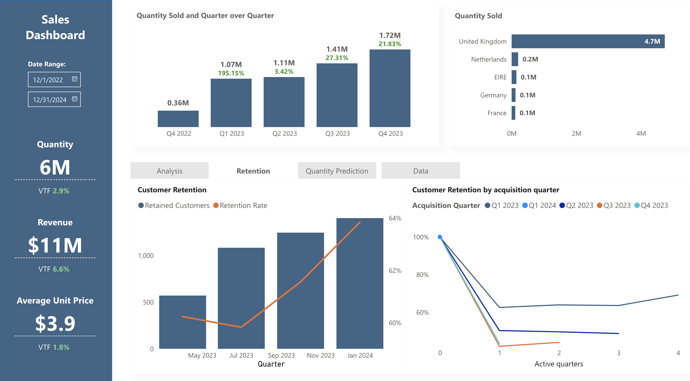
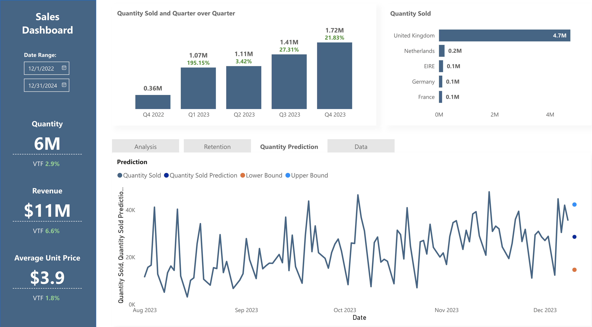
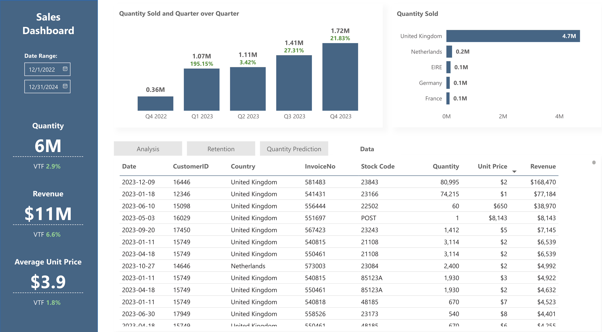

# PowerBI Dashboard

* [Concept](#concept)
* [Dashboard](#dashboard)

## Concept

This project is a small example of a [PowerBI](https://www.microsoft.com/en-us/power-platform/products/power-bi)  dashboard for a Sales Team with data stored in a local [DuckDB](https://duckdb.org/) database.
The system leverages a Python [Jupyter Notebook](https://jupyter.org/) for predictive analytics: the output of the model run on the notebook, is saved in the DuckDB local database and available in a dedicated section in the dashboard.

Below a very simple diagram of the system:

## Dashboard

View with a decomposition tree:

View with Retention analytics:

View with actual data and the predicted data point from the Jupyter Notebook model:

View with data exploration option:

